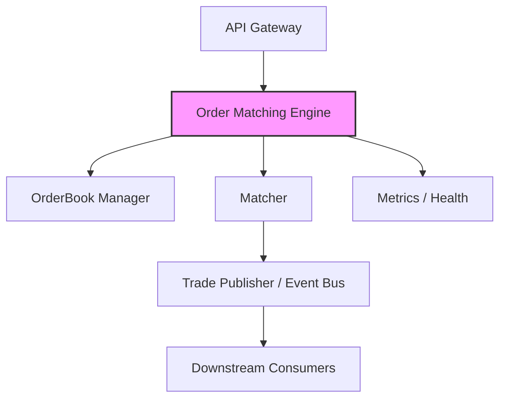
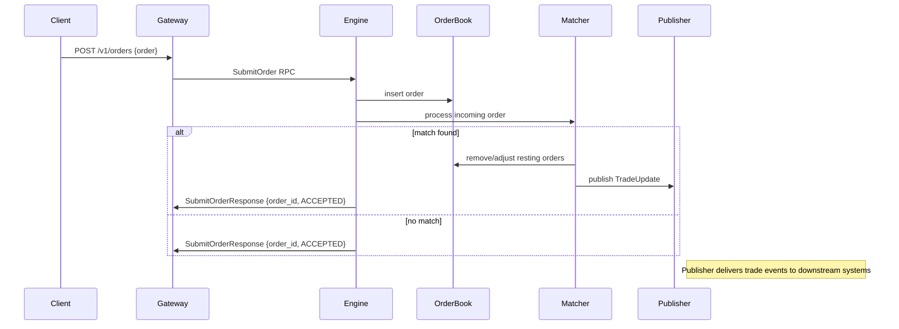
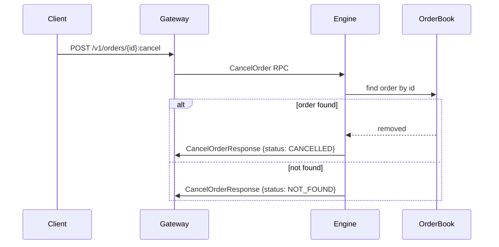

# Order Matching Engine — System Design

This document describes the architecture and design of the Order Matching Engine microservice. It includes component diagrams and sequence flows to explain how orders are received, matched, and how the API layer interacts with the engine.

## Overview

The Order Matching Engine is a standalone microservice written in modern C++ (C++20). It exposes a gRPC API (defined in `proto/order_service.proto`) to accept order submissions, order modifications, cancellations, and to stream trade updates. Key responsibilities:

- Maintain a highly available in-memory order book per symbol.
- Perform price-time priority matching of incoming orders.
- Emit executed trade events and update order states.
- Expose gRPC endpoints for gateway/services to interact with.

Core modules:

- Networking / gRPC server — receives RPCs and invokes engine logic.
- OrderBook — in-memory data structure for bids & asks with efficient lookup by price and order id.
- Matcher — matching algorithm that processes incoming orders and produces trade events.
- TradeLog / persistence (optional) — append executed trades for auditing and downstream consumers.

## Component Diagram

Notes:

- The API Gateway performs protocol translation (HTTP to gRPC) and exposes REST endpoints to clients. In production the gateway should be a separate service (we used Java Spring Boot for demo purposes).
- The Trade Publisher may integrate with Kafka, Redis streams, or another messaging bus for scaling consumers.

## Sequence Diagram — Submit Order (happy path)

## Sequence Diagram — Cancel Order

## Data Model (high level)

- Order { order_id, client_id, symbol, side, price, quantity, timestamp, status }
- OrderBookEntry { price, total_quantity, orders[] }
- TradeUpdate { buy_order_id, sell_order_id, price, quantity, symbol, timestamp }

## Performance & Concurrency Considerations

- The in-memory OrderBook uses price-buckets (map price -> price-level) and a deque/list for time-priority per price.
- Concurrency model should ensure:
  - Single-writer for a given symbol (e.g., a worker thread or shard per symbol) to avoid heavy locking.
  - Read operations (GetOrderBook) can use snapshotting or shared locks.
- For production, partition symbols across threads/processes (sharding) and persist or stream trade events for reliability.

## Observability

- Exposed Prometheus metrics (orders/sec, trades/sec, best-bid/ask latencies).
- Health endpoint (gRPC health check) and readiness probes for container orchestration.
- Structured logging with levels (INFO for high-level events, DEBUG for trace during development).

## Extensibility

- Plug-in Risk checks before accepting an order.
- Order persistence layer for recovery (WAL or snapshotting).
- Circuit-breaker or back-pressure mechanisms to protect the matcher under overload.

---
